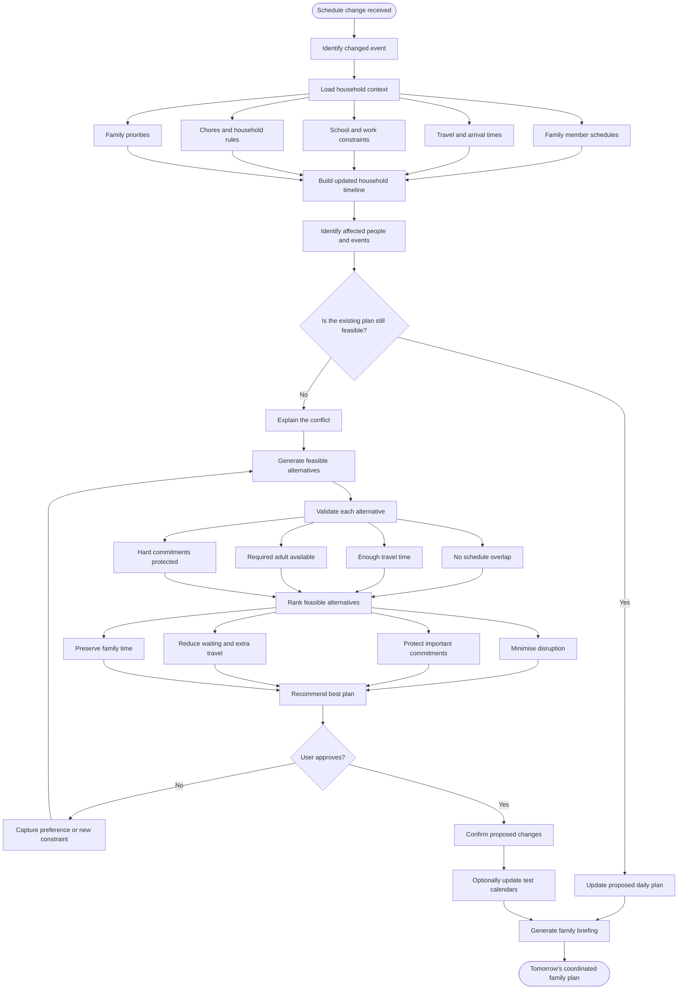

# Alfred — Use Case 1: Intelligent Family Replanning

## Purpose

Demonstrate Alfred's core intelligence: when one family commitment changes, Alfred evaluates the effect across the household, identifies conflicts, generates feasible alternatives, ranks the trade-offs, and asks for approval before changing the plan.

This use case focuses on planning intelligence rather than calendar display or calendar CRUD operations.

## Flow diagram



The standalone Mermaid source is available in [`docs/flow-diagram.md`](./docs/flow-diagram.md).

## Demo example

### Trigger

The son's football training moves from **17:00 to 16:30**.

### Household context

- The son must leave home at **16:05** to arrive on time.
- Dad is scheduled to work at the office.
- Mom must collect the daughter at **16:15**.
- Both journeys require an adult.

### Conflict detected

Under the original plan, no parent can complete both journeys on time. Alfred identifies the people and commitments affected and explains the conflicting times.

### Alternatives generated

| Option | Proposed adjustment | Trade-off |
|---|---|---|
| A | Dad leaves work early and takes the son to football. | Dad's workday is shortened. |
| B | Mom takes the son first and the daughter uses a pre-approved alternative pickup. | Requires an approved pickup arrangement. |
| C | The son misses football training. | Avoids transport changes but sacrifices the activity. |

### Recommendation

Alfred recommends **Option A**, assuming Dad is permitted to leave work early, because it satisfies the hard constraints and causes the least disruption to the children's commitments.

### Approval

Alfred asks:

> Dad can leave work at 15:35 and take the son to football. This keeps both children's commitments. Should I apply this to the proposed family plan?

Alfred does not write to any external calendar until the user approves the proposal.

### Final briefing

> Football has moved to 16:30. Dad should leave work at 15:35 and leave home with the son at 16:05. Mom collects the daughter at 16:15. No other commitments are affected.

## Inputs

The first implementation needs only:

- Family profiles and relationships.
- Events with start and end times.
- Event locations.
- Travel durations between relevant locations.
- Participant and responsible-adult requirements.
- Hard constraints, such as school and work commitments.
- Soft preferences, such as minimising disruption or protecting family time.

## Expected output

The planning service should return structured data similar to:

```json
{
  "status": "conflict_detected",
  "changed_event": "football_training",
  "affected_people": ["son", "dad", "mom", "daughter"],
  "conflicts": [
    {
      "type": "adult_unavailable",
      "message": "No parent is available to cover both journeys under the original plan."
    }
  ],
  "alternatives": [
    {
      "id": "option_a",
      "summary": "Dad leaves work early and takes the son to football.",
      "feasible": true,
      "score": 0.91,
      "trade_offs": ["Dad leaves work early"]
    }
  ],
  "recommended_option": "option_a",
  "approval_required": true
}
```

## Acceptance criteria

- A changed event triggers a fresh household feasibility check.
- Alfred identifies the exact people, events, and travel windows affected.
- Time and travel calculations are deterministic and handled in application code.
- Infeasible alternatives are rejected before recommendation.
- The recommended option includes a plain-language reason and visible trade-offs.
- No external event is changed without explicit user approval.
- Alfred produces a concise briefing after approval.

## Suggested API boundary

```text
POST /plan/change
  Input: changed event + household context
  Output: conflicts + ranked alternatives + recommendation

POST /plan/approve
  Input: selected alternative
  Output: confirmed proposed plan + briefing
```
